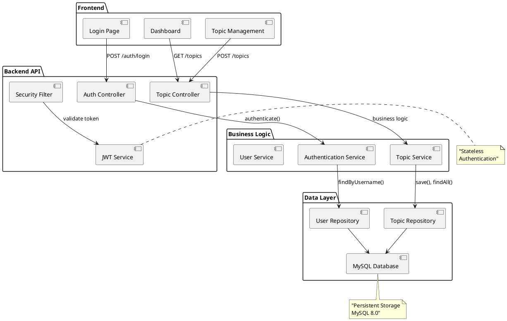

# 🚀 Foro Técnico - API REST Completa

<div align="center">


**Una plataforma de foro moderna y escalable construida con las mejores prácticas de desarrollo**

[🔥 Demo en Vivo](#-instalación-y-uso) • [📖 Documentación](#-características) • [🛠️ API](#-endpoints-principales)

</div>

---

## ✨ Características Principales

### 🔐 **Autenticación y Seguridad**
- **JWT Authentication** - Tokens seguros para autenticación
- **Spring Security** - Protección completa de endpoints
- **Encriptación BCrypt** - Contraseñas hasheadas
- **CORS Configurado** - Acceso desde frontend

### 📝 **Gestión de Topics**
- **CRUD Completo** - Crear, leer, actualizar, eliminar
- **Categorías Predefinidas** - Java, Spring, Database, DevOps, etc.
- **Estados Dinámicos** - Abierto, En Progreso, Resuelto, Cerrado
- **Contador de Vistas** - Tracking automático de visualizaciones
- **Paginación** - Listado eficiente de contenido

### 💬 **Sistema de Comentarios**
- **Comentarios por Topic** - Discusiones completas
- **CRUD de Comentarios** - Crear y eliminar comentarios
- **Autorización** - Solo el autor puede eliminar sus comentarios
- **Tiempo Real** - Actualización automática de comentarios

### 🎨 **Frontend Moderno**
- **Multi-página** - Login → Dashboard → Topic Detail
- **Interfaz Intuitiva** - Navegación fluida entre secciones
- **Tiempo Real** - Actualización automática de datos
- **Categorías Visuales** - Colores por estado y tipo
- **Responsive Design** - Adaptable a cualquier dispositivo

### 🏗️ **Arquitectura Robusta**
- **Clean Architecture** - Separación clara de responsabilidades
- **Repository Pattern** - Abstracción de datos
- **DTO Pattern** - Transferencia segura de datos
- **Exception Handling** - Manejo global de errores

---

## 🛠️ Stack Tecnológico

| Tecnología | Versión | Propósito |
|------------|---------|-----------|
| **Java** | 21 | Lenguaje principal |
| **Spring Boot** | 3.5.4 | Framework backend |
| **Spring Security** | 6.5.2 | Autenticación y autorización |
| **Spring Data JPA** | 3.5.2 | Persistencia de datos |
| **MySQL** | 8.0 | Base de datos |
| **JWT** | 4.2.0 | Tokens de autenticación |
| **Swagger** | 2.6.0 | Documentación API |
| **Lombok** | 1.18.38 | Reducción de boilerplate |

---

## 📊 Diagrama de Arquitectura



---

## 🚀 Instalación y Uso

### Prerrequisitos
- ☕ **Java 21+**
- 🗄️ **MySQL 8.0+**
- 🔧 **Maven 3.6+**

### 1️⃣ Clonar el Repositorio
```bash
git clone https://github.com/tu-usuario/proyecto-foro.git
cd proyecto-foro
```

### 2️⃣ Configurar Base de Datos
```sql
CREATE DATABASE foro_db;
```

### 3️⃣ Configurar Aplicación
Edita `src/main/resources/application.properties`:
```properties
spring.datasource.url=jdbc:mysql://localhost:3306/foro_db
spring.datasource.username=tu_usuario
spring.datasource.password=tu_password
```

### 4️⃣ Ejecutar Aplicación
```bash
# Windows
mvnw.cmd spring-boot:run

# Linux/Mac
./mvnw spring-boot:run
```

### 5️⃣ Verificar que la aplicación esté ejecutándose
La aplicación estará disponible en:
- **Backend API**: http://localhost:8081
- **Swagger UI**: http://localhost:8081/swagger-ui.html

### 6️⃣ Acceder al Frontend
Abre en tu navegador:
```
file:///C:/ruta/completa/al/proyecto/frontend/login.html
```

**🔑 Credenciales de prueba:**
- **Usuario**: `admin`
- **Contraseña**: `123456`

### 8️⃣ Explorar Funcionalidades
1. **Crear Topics** con diferentes categorías
2. **Hacer clic en títulos** para ver detalles
3. **Agregar comentarios** a los topics
4. **Ver interacciones** en tiempo real

### 7️⃣ Probar la API (Opcional)
Puedes probar directamente con herramientas como Postman o Insomnia:

**Login:**
```http
POST http://localhost:8081/auth/login
Content-Type: application/json

{
  "username": "admin",
  "password": "123456"
}
```

**Crear Topic:**
```http
POST http://localhost:8081/topics
Content-Type: application/json
Authorization: Bearer {tu_token_aqui}

{
  "title": "Mi primer topic",
  "message": "Contenido del topic",
  "category": "JAVA"
}
```

---

## 🎯 Guía de Uso Rápido

### 📋 Pasos para probar el sistema:

1. **🚀 Ejecuta la aplicación** con `mvnw.cmd spring-boot:run`
2. **🌐 Abre el frontend** en `frontend/login.html`
3. **🔐 Inicia sesión** con `admin` / `123456`
4. **📝 Crea un topic** seleccionando una categoría
5. **🔍 Haz clic en el título** para ver detalles del topic
6. **💬 Agrega comentarios** y ve la interacción
7. **👀 Observa contadores** de vistas actualizándose
8. **📊 Explora la API** en http://localhost:8081/swagger-ui.html

### 🔗 Enlaces importantes:
- **Frontend**: `file:///[ruta-proyecto]/frontend/login.html`
- **API Base**: http://localhost:8081
- **Swagger**: http://localhost:8081/swagger-ui.html
- **Base de datos**: MySQL en puerto 3306

---

## 🔗 Endpoints Principales

### 🔐 Autenticación
```http
POST /auth/login     # Iniciar sesión
POST /auth/register  # Registrar usuario
```

### 📝 Topics
```http
GET    /topics       # Listar topics (paginado)
GET    /topics/{id}  # Obtener topic específico
POST   /topics       # Crear nuevo topic
PUT    /topics/{id}  # Actualizar topic
DELETE /topics/{id}  # Eliminar topic
```

### 💬 Comentarios
```http
GET    /topics/{id}/comments           # Listar comentarios de un topic
POST   /topics/{id}/comments           # Crear comentario
DELETE /topics/{id}/comments/{commentId} # Eliminar comentario
```

### 📚 Documentación
```http
GET /swagger-ui.html # Documentación interactiva
```

---

## 🎯 Ejemplos de Uso

### Crear Topic
```json
POST /topics
Authorization: Bearer {token}

{
  "title": "Problema con Spring Security",
  "message": "¿Cómo configurar JWT correctamente?",
  "category": "SPRING"
}
```

### Crear Comentario
```json
POST /topics/1/comments
Authorization: Bearer {token}

{
  "content": "Puedes usar @EnableWebSecurity y configurar SecurityFilterChain"
}
```

### Respuesta Topic
```json
{
  "id": 1,
  "title": "Problema con Spring Security",
  "message": "¿Cómo configurar JWT correctamente?",
  "category": "SPRING",
  "status": "OPEN",
  "views": 5,
  "author": "admin",
  "creationDate": "2025-01-29T10:30:00",
  "lastModified": "2025-01-29T10:30:00"
}
```

---

## 🏆 Características Avanzadas

### 🎨 Categorías Disponibles
- **JAVA** - Desarrollo Java
- **SPRING** - Spring Framework
- **DATABASE** - Base de Datos
- **FRONTEND** - Desarrollo Frontend
- **BACKEND** - Desarrollo Backend
- **DEVOPS** - DevOps y CI/CD
- **MOBILE** - Desarrollo Móvil
- **GENERAL** - Temas generales

### 📊 Estados de Topics
- 🟢 **OPEN** - Abierto para discusión
- 🟡 **IN_PROGRESS** - En proceso de resolución
- 🔵 **RESOLVED** - Problema resuelto
- 🔴 **CLOSED** - Cerrado
- ⚫ **ARCHIVED** - Archivado

---

## 🤝 Contribuir

1. Fork el proyecto
2. Crea una rama para tu feature (`git checkout -b feature/AmazingFeature`)
3. Commit tus cambios (`git commit -m 'Add some AmazingFeature'`)
4. Push a la rama (`git push origin feature/AmazingFeature`)
5. Abre un Pull Request

---

## 📄 Licencia

Este proyecto está bajo la Licencia MIT - ver el archivo [LICENSE](LICENSE) para más detalles.

---

## 👨‍💻 Autor

**Tu Nombre**
- GitHub: [@tu-usuario](https://github.com/tu-usuario)
- LinkedIn: [Tu Perfil](https://linkedin.com/in/tu-perfil)

---

<div align="center">

**⭐ ¡Dale una estrella si te gustó el proyecto! ⭐**

*Construido con ❤️ y mucho ☕*

</div>